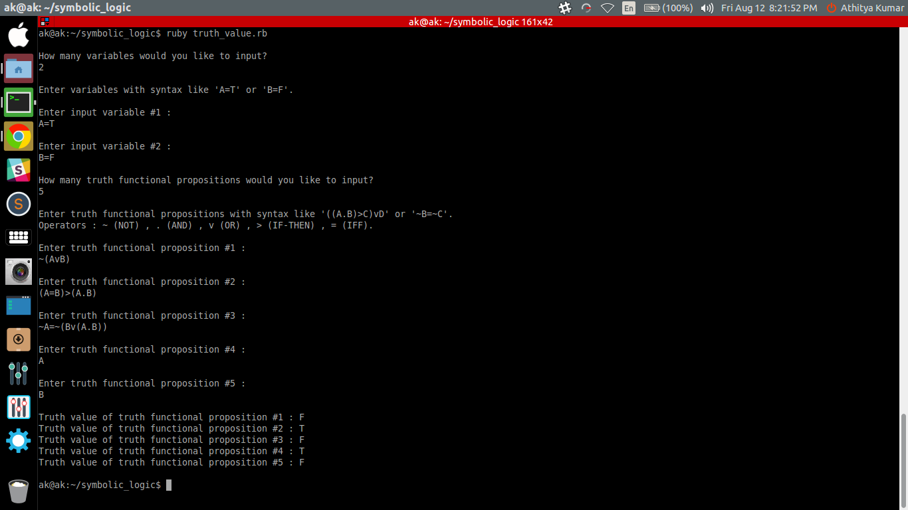

SYMBOLIC LOGIC 
--------------
Symbolic Logic (HS30068) is a course taken by Prof. Chhanda Chakraborthy at IIT Kharagour. Thise repository is a showcase of codes that implement the automated solving of symbolic logic methods that are taught in class.

SCRIPTS
-------

- [x] `truth_value.rb` 
  - [x] This is a code that takes truth-valued variables as input and then decides the truth-value of a truth functional statement.
  - [x] A working sample of the code is attached below.    

USING SYMBOLIC-LOGIC SCRIPTS
----------------------------
Type these commands on a terminal - 
  (1)  `git clone git@github.com:athityakumar/symbolic-logic.git`
  (2)  `cd symbolic-logic`
  (3)  `ruby <script_name>.rb`

CONTRIBUTION
------------
The work flow is the same as that of any other repository. 
  (1) Fork / clone the repository.
  (2) Create a new branch , say `my-changes` and make your changes in this branch.
  (3) Commit your changes and send a Pull request (PR) to this repository.
  Active contributors would be rewarded with the tag of "Collabrators"
  Bug fixes , Issues , Issue solutions , Optimizations & Enhancements are always welcome.

LICENSE
-------
The MIT License - [Athitya Kumar](http://github.com/athityakumar) - All Rights Reserved.
